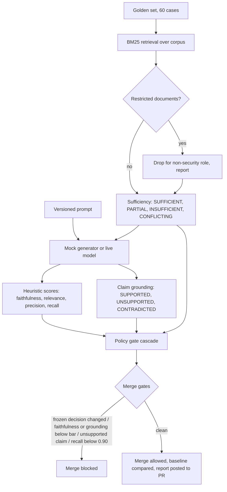
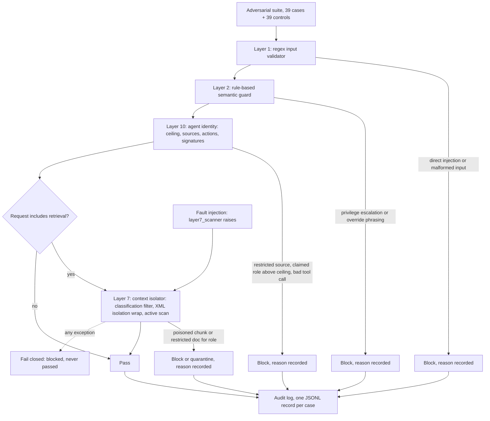
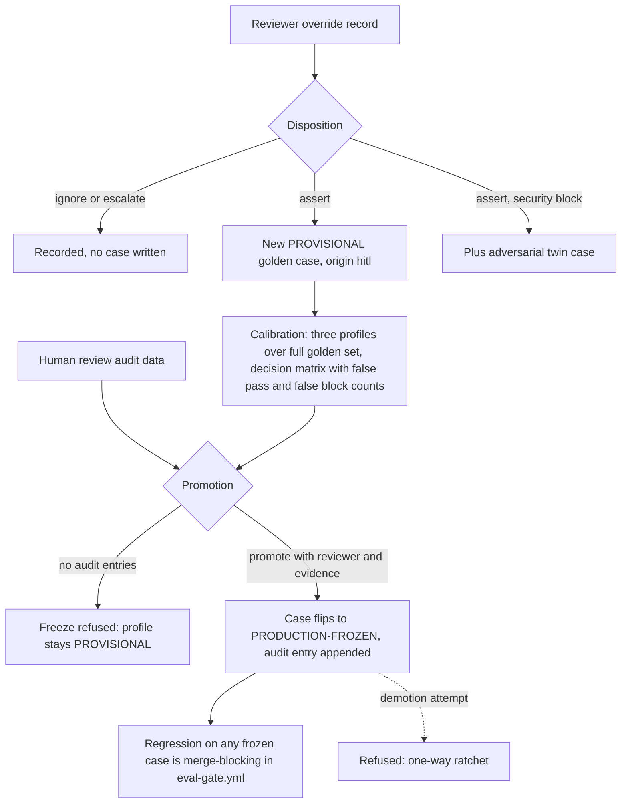

# Architecture

Three flows carry the chapter: the evaluation gate, the red-team pipeline, and the HITL promotion loop.

## Evaluation gate flow (15.1, builds on Chapter 4)

The gate compares against `baselines/metrics_baseline.json`, the committed record of the last approved run. `--update-baseline` rewrites it for review; the diff is reviewed like any other change.

## Red-team pipeline (15.4, builds on Chapter 14)

With `--fault-inject layer7_scanner`, every retrieval-dependent case must block with a fail-closed reason and the run still exits 0. That is the Chapter 14 contract proven in CI, not asserted in a comment.

## HITL promotion loop (15.5)

