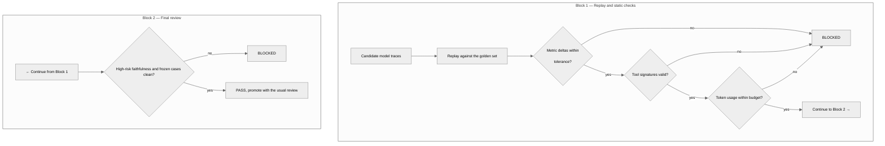

## Figure 15.4

```mermaid
%%{init: {"theme": "neutral", "themeVariables": {"fontFamily": "Arial, Helvetica, sans-serif", "fontSize": "11px", "actorFontSize": "11px", "noteFontSize": "10px", "messageFontSize": "10px"}}}%%flowchart TD
    subgraph Block1 ["Block 1 — Replay and static checks"]
        TRACES["Candidate model traces"]
        REPLAY["Replay against the golden set"]
        DELTA{"Metric deltas within

tolerance?"}
SIGS{"Tool signatures valid?"}
BUDGET{"Token usage within budget?"}
BLOCKED_1["BLOCKED"]
CONT_B2["Continue to Block 2 →"]

    TRACES --> REPLAY
    REPLAY --> DELTA

    DELTA -->|"no"| BLOCKED_1
    DELTA -->|"yes"| SIGS

    SIGS -->|"no"| BLOCKED_1
    SIGS -->|"yes"| BUDGET

    BUDGET -->|"no"| BLOCKED_1
    BUDGET -->|"yes"| CONT_B2
end

subgraph Block2 ["Block 2 — Final review"]
    CONT_B1["← Continue from Block 1"]
    FAITH{"High-risk faithfulness and frozen cases clean?"}
BLOCKED_2["BLOCKED"]
PASS["PASS, promote with the usual review"]

    CONT_B1 --> FAITH
    FAITH -->|"no"| BLOCKED_2
    FAITH -->|"yes"| PASS
end

```
